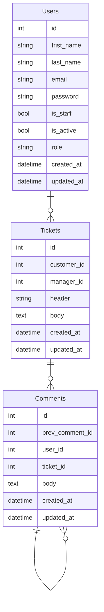

# Support service application


## Adjust the application

### Create `.env` file based on `.env.default`
```bash
# Unix
cp .env.default .env

# Windows
# ...
```


### Install deps

```bash
pipenv sync --dev

# Activate the environment
pipenv shell
```


## Code quality tools
...


## Application description
```bash
▾ users
    ├─ apps.py # Django apps configuration
    ├─ urls.py # pre-controller
    ├─ views.py # Endopints / post-controller
    ├─ models.py # Database tables mapper
    ├─ admin.py # Database tables mapper
    # └─ views.py # Endopints / post-controller
```


# Database

